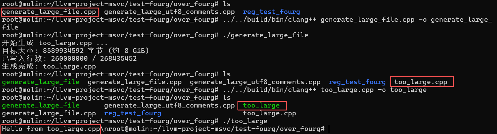
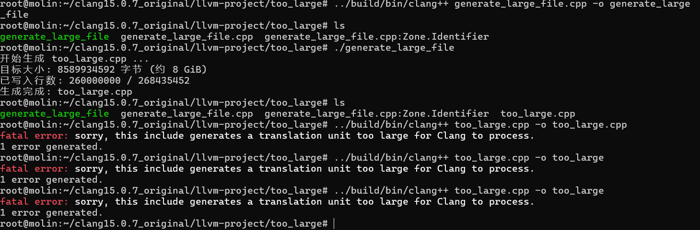

### original 中的内容：
1、reg_test_orig是对未修改前的clang15.0.7进行回归测试的结果

2、oyzl_test_original.sh是对修改后的clang15.0.7进行一些基础的c/c++测试的脚本，均通过。

### over_fourg中的内容：
1、reg_test_fourg是对修改后的clang15.0.7进行回归测试的结果，llvm-check与修改前一致，clang-check多出了77个failure，估计是修改未完全

2、generate_large_file.cpp编译运行后会产生一个8GB的大文件（内容是#if 0 ... #endif和很多单行注释，以及一段文本打印）too_large.cpp

编译运行：
- ../build/bin/clang++ generate_large_file.cpp -o generate_large_file
- ./generate_large_file
- ../build/bin/clang++ too_large.cpp.cpp -o too_large.cpp
- ./too_large

结果：

- 修改后的可以成功编译运行too_large.cpp

- 原始版本无法编译该文件
